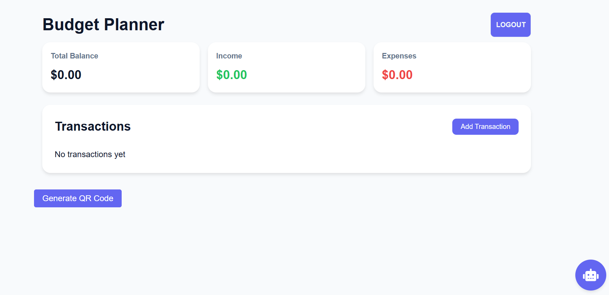

# Budget Planner App 📊

A modern, secure, and user-friendly budget planning application that helps users manage their finances effectively. The app features biometric authentication for enhanced security and provides an intuitive interface for tracking expenses and income.



## 🌟 Features

- **Secure Authentication**

  - Google Sign-In integration
  - Biometric authentication (fingerprint/Face ID)
  - Persistent login sessions

- **Core Functionality**

  - Income and expense tracking
  - Budget categorization
  - Monthly/yearly financial overview
  - Expense analytics and reports

- **Security**
  - Data encryption
  - Secure authentication flows
  - HTTPS enforcement
  - Regular security updates

## 🛠️ Technologies Used

- HTML5, CSS3, JavaScript (ES6+)
- Web Authentication API (WebAuthn)
- Google Authentication
- Progressive Web App (PWA) features
- Local Storage for data persistence
- Google Analytics for usage tracking

## 📋 Prerequisites

Before you begin, ensure you have the following installed:

- Latest version of Chrome, Firefox, or Safari
- Node.js (v14 or higher)
- npm (v6 or higher)
- A code editor (VS Code recommended)
- Git

## 🚀 Getting Started

1. **Clone the repository**

   ````bash
   git clone https://github.com/whitemouse25/budget-web-app.git
   cd budget-web-app   ```

   ````

2. **Install dependencies**

   ```bash
   npm install
   ```

3. --

4. **Start the development server**

   ```bash
   npm start
   ```

5. **Open the application**
   Visit `http://localhost:3000` in your browser

## 💻 Local Development

To run the app locally with full functionality:

1. **Enable HTTPS locally**

   - Generate SSL certificates for local development
   - Configure your local server to use HTTPS (required for biometric authentication)

2. **Set up authentication**

   - Configure Google OAuth credentials
   - Enable biometric authentication in your browser settings

3. **Testing**
   ```bash
   npm test
   ```

## 🌐 Deployment

The app is live at: https://whitemouse25.github.io/budget-web-app/

To deploy your own version:

1. **GitHub Pages Setup**

   ```bash
   npm run deploy
   ```

2. **Enable GitHub Pages**
   - Go to repository settings
   - Navigate to "Pages"
   - Select the branch to deploy (usually `gh-pages`)
   - Save the settings

## 🔒 Security Considerations

- The app uses secure authentication methods
- All data is encrypted in transit
- Biometric data never leaves the user's device
- Regular security audits are performed

## 📱 PWA Support

The Budget Planner is a Progressive Web App (PWA) that can be installed on:

- Android devices
- iOS devices
- Desktop computers

## 🤝 Contributing

1. Fork the repository
2. Create a feature branch
3. Commit your changes
4. Push to the branch
5. Open a Pull Request

Made with ❤️ by [Sandesh Gorathoki]

```
Last Updated: February 2024
```
